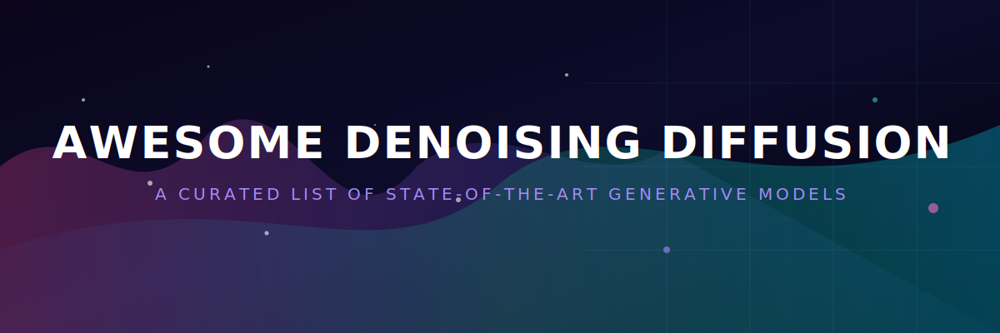
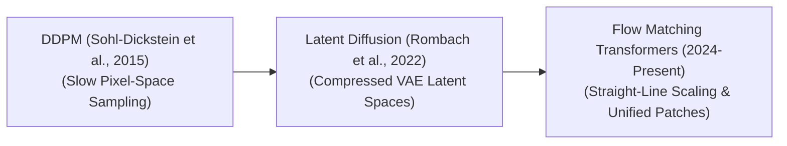

  
  
  

    
  

# 🌟 Awesome-Denoising-Diffusion

## 📐 Denoising Diffusion Models: Evolution, Variants, Types, & Applications 🧬

Welcome to the ultimate curated resource list for **Denoising Diffusion Probabilistic Models (DDPM)**, **Score-Based Generative SDEs**, **Flow Matching / Rectified Flow Models**, and **Diffusion Transformers (DiT)**. This repository tracks the chronological evolution, mathematical fundamentals, training optimizations, structural distillation, hardware-aware implementations (like FlashAttention), and cutting-edge applications in text-to-image synthesis, spatio-temporal video generation (like Sora), and biotech protein design.

Denoising Diffusion Models represent a dominant class of generative artificial intelligence architectures capable of synthesizing high-fidelity images, videos, audio waveforms, and molecular structures. Mathematically, these models operate by framing data generation as the reverse of a progressive noise injection process. During the forward pass, a dataset sample is systematically degraded into pure Gaussian noise over a series of chronological time-steps. The diffusion model is then trained to predict and subtract this noise iteratively, mathematically mapping a chaotic noise distribution back into a clean, sharp data manifold.

---

## ⏱️ 1. The Chronological Evolution

The algorithmic progression of denoising diffusion models has transitioned from highly latent pixel-space math to compressed latent vectors, ordinary differential equation (ODE) straight lines, and scalable multi-modal transformers.

| Era / Concept | Year | Paper Link | Description / Details |
| :--- | :--- | :--- | :--- |
| **[The Foundational Formulation Era (DDPM)](./details/ddpm.md)** | 2015 / 2020 | Sohl-Dickstein et al. (2015): [arXiv:1503.03585](https://arxiv.org/abs/1503.03585) Ho et al. (2020): [arXiv:2006.11239](https://arxiv.org/abs/2006.11239) | **Concept:** The structural baseline. **Denoising Diffusion Probabilistic Models (DDPM)** formalized the discrete-time Markov chain framework. A convolutional **U-Net** backbone learned to predict the noise distribution added to raw image pixels at explicit time-steps. **Limitation:** Catastrophically computationally expensive. Generating a single image required running hundreds or thousands of sequential forward passes through the pixel-space U-Net, introducing immense processing latency. |
| **[The Latent Space Compression Era (Stable Diffusion)](./details/latent-diffusion.md)** | 2022 | Rombach et al. (2022): [arXiv:2112.10752](https://arxiv.org/abs/2112.10752) | **Concept:** Resolved the pixel-space latency crisis. Instead of running the denoising loops on high-resolution pixels, **Latent Diffusion Models (LDMs)** use a Variational Autoencoder (VAE) to compress images into a highly dense, lower-dimensional latent space. The U-Net then executes denoising steps over this compressed matrix. **Significance:** Democratic access to generation. It slashed the computational compute requirements, letting developers train and execute high-fidelity image synthesis on standard consumer-grade GPUs. |
| **[The Diffusion Transformer & Flow Matching Era](./details/diffusion-transformers.md)** | 2022–2024 | Peebles & Xie (2023): [arXiv:2212.09748](https://arxiv.org/abs/2212.09748) Lipman et al. (2023): [arXiv:2210.02747](https://arxiv.org/abs/2210.02747) | **Concept:** The current modern state-of-the-art foundation standard. Popularized by architectures like Stable Diffusion 3, Midjourney v6, and Black Forest Labs' **FLUX** series. It completely discards convolutional U-Net architectures, replacing them with a scalable **Diffusion Transformer (DiT)** backbone. Images are sliced into structural token patches, and the denoising path is optimized via straight-line **Flow Matching** ordinary differential equations (ODEs). |

---

## 🔬 2. Core Functional & Mathematical Variants

The Diffusion family tree features specialized mathematical core modifications designed to optimize sampling speed, manage probability paths, and enable non-Markovian generation.

| Variant | Year | Paper Link | Description / Details |
| :--- | :--- | :--- | :--- |
| **[Denoising Diffusion Implicit Models (DDIM)](./details/ddim.md)** | 2020 | Song et al. (2020): [arXiv:2010.02502](https://arxiv.org/abs/2010.02502) | **Mechanism:** Generalizes DDPM into a non-Markovian deterministic trajectory. Because the generation path follows fixed mathematical equations rather than stochastic random walks, it allows the model to skip time-steps during inference. **Pros:** Drastically compresses generation latency, requiring only 20 to 50 steps to output crisp graphics instead of the 1,000 steps demanded by DDPM. |
| **[Score-Based Generative SDEs (Continuous Time)](./details/score-sde.md)** | 2020 | Song et al. (2020): [arXiv:2011.13456](https://arxiv.org/abs/2011.13456) | **Mechanism:** Popularized by Song et al. It models the forward and reverse diffusion pathways as continuous-time Stochastic Differential Equations (SDEs), utilizing score matching to estimate the gradient of the log-probability density of the data. **Pros:** Provides a unified mathematical umbrella that links traditional diffusion models cleanly with score-based energy networks. |
| **[Flow Matching / Rectified Flow Models](./details/flow-matching.md)** | 2022 | Lipman et al. (2022): [arXiv:2210.02747](https://arxiv.org/abs/2210.02747) Liu et al. (2022): [arXiv:2209.03003](https://arxiv.org/abs/2209.03003) | **Mechanism:** Replaces traditional curved Gaussian denoising trajectories with linear, straight ordinary differential equation (ODE) vector directions. **Pros:** Vastly accelerates convergence speed, allowing high-fidelity, single-turn, or 4-step real-time generation when combined with consistency distillation. |

---

## ⚡ 3. Structural Sampling & Distillation Classes

To deploy diffusion models within interactive, low-latency commercial applications, specialized distillation layers compress the multi-step sampling loop.

| Class / Technique | Year | Paper Link | Description / Details |
| :--- | :--- | :--- | :--- |
| **[Classifier-Free Guidance (CFG)](./details/cfg.md)** | 2021 | Ho & Salimans (2021): [arXiv:2207.12598](https://arxiv.org/abs/2207.12598) | **Profile:** Prompt conditioning multiplier. During the denoising pass, the model calculates two parallel pathways: a text-conditioned prediction and an unconditioned prediction. The system scales up the delta between them via a **CFG scale parameter**, letting developers dynamically tune how strictly the generation adheres to the prompt text versus creative variance. |
| **[Latent Consistency Models (LCM) / Adversarial Distillation](./details/lcm.md)** | 2023 | Luo et al. (2023): [arXiv:2310.04378](https://arxiv.org/abs/2310.04378) | **Profile:** Step-collapsing distillation layers. LCMs treat the continuous generation path as a consistency function, training a student network to predict the final, fully denoised latent vector at step zero in a single computational jump. **Significance:** Unlocks high-volume, real-time interactive generation pipelines (1-step to 4-step sampling) for streaming live content. |

---

## ⚙️ 4. Production Engineering Challenges & Hardware Solutions

Executing multi-step diffusion sampling loops across commercial cloud scales introduces severe memory-bus constraints and infrastructure processing bottlenecks.

| Challenge & Solution | Year | Paper Link | Description / Details |
| :--- | :--- | :--- | :--- |
| **[The Transformer Sequence Length Wall (Megapixel Explosion)](./details/transformer-sequence-wall.md)** | 2022 / 2023 | FlashAttention (2022): [arXiv:2205.14135](https://arxiv.org/abs/2205.14135) GQA (2023): [arXiv:2305.13245](https://arxiv.org/abs/2305.13245) | **The Problem:** When scaling up Diffusion Transformers (DiTs) to generate massive $1024 \times 1024$ megapixel outputs or continuous video streams, slicing the latent spaces into fine patches creates thousands of active tokens. This causes the internal self-attention matrix calculation to hit a quadratic ($O(N^2)$) memory footprint wall, triggering cluster-wide VRAM crashes. **Mitigation:** Implementing **FlashAttention hardware-aware register fusion**, coupled with **Grouped-Query Attention (GQA)** to compress the scale of the active cached attention matrices. |
| **[The Fine-Grained Layout Control Deficit](./details/fine-grained-layout-control.md)** | 2023 | ControlNet (2023): [arXiv:2302.05543](https://arxiv.org/abs/2302.05543) IP-Adapter (2023): [arXiv:2308.06721](https://arxiv.org/abs/2308.06721) | **The Problem:** Natural language text descriptions are inherently ambiguous. Forcing a denoising loop to place an object at exact pixel locations or match a highly specific human posture using text prompts alone is highly inefficient. **Mitigation:** Layering auxiliary adapter networks like **ControlNet** or **IP-Adapter**, which inject structural conditioning maps (Canny edges, depth maps, openpose skeletons, or image style vectors) directly into the frozen base model weights. |

---

## 🌌 5. Frontier Real-World AI Applications

| Application | Year | Paper Link | Description / Details |
| :--- | :--- | :--- | :--- |
| **[Text-to-Image and Graphic Asset Foundation Engines](./details/text-to-image-engines.md)** | 2021 / 2022 | GLIDE (2021): [arXiv:2112.10741](https://arxiv.org/abs/2112.10741) Imagen (2022): [arXiv:2205.11487](https://arxiv.org/abs/2205.11487) | **Application:** Powers commercial asset platforms (such as Midjourney, FLUX, Adobe Firefly). Hybrid CLIP/T5 text conditioning modules project user prompts into deep DiT cores, synthesizing high-resolution, photorealistic creative marketing, branding, and typography graphics natively. |
| **[Spatio-Temporal Physics Video Generation (Sora Class)](./details/video-generation.md)** | 2022 / 2024 | VDM (2022): [arXiv:2204.03458](https://arxiv.org/abs/2204.03458) Sora (2024): [Technical Report](https://openai.com/research/video-generation-models-as-world-simulators) | **Application:** Drives next-generation automated pre-visualization and movie composition pipelines. Video clips are tokenized into 3D spacetime cubes; the diffusion transformer removes noise across these cubes concurrently, predicting straight-line trajectories to generate physically consistent, fluid video animations. |
| **[De Novo Molecular Docking and Protein Design (BioTech)](./details/protein-design.md)** | 2022 / 2023 | DiffDock (2022): [arXiv:2210.01776](https://arxiv.org/abs/2210.01776) RFdiffusion (2023): [Nature Paper](https://www.nature.com/articles/s41587-023-01830-6) | **Application:** Accelerates target-specific drug discovery and structural biology research. Specialized SE(3)-equivariant diffusion models (such as AlphaFold 3 or RFdiffusion) treat molecular atomic coordinate fields as data clouds, denoising random initial spaces into stable, valid 3D protein backbones that satisfy explicit biochemical bonding rules. |

---

## 📚 References

1. Sohl-Dickstein, J., et al. (2015). Deep unsupervised learning using nonequilibrium thermodynamics. *International Conference on Machine Learning (ICML)*, 2256-2275.
2. Ho, J., Jain, A., & Abbeel, P. (2020). Denoising diffusion probabilistic models. *Advances in Neural Information Processing Systems (NeurIPS)*, 33, 6840-6880.
3. Song, J., Meng, C., & Ermon, S. (2020). Denoising diffusion implicit models. *arXiv preprint arXiv:2010.02502*.
4. Rombach, R., et al. (2022). High-resolution image synthesis with latent diffusion models. *Proceedings of the IEEE/CVF Conference on Computer Vision and Pattern Recognition (CVPR)*, 10684-10695.
5. Peebles, W., & Xie, S. (2023). Scalable diffusion models with transformers. *Proceedings of the IEEE/CVF International Conference on Computer Vision (ICCV)*, 4165-4126.
6. Lipman, Y., et al. (2023). Flow matching for generative modeling. *International Conference on Learning Representations (ICLR)*.

---

## 🛠️ Next Steps & Development Pathways

To advance this documentation repository, infrastructure workspace, or implementation setup, consider exploring these adjacent development pathways:
* Build a **Python code snippet using the Hugging Face `diffusers` library** illustrating how to load a Latent Diffusion Pipeline and pass custom image-to-image structural masks through an execution loop.
* Generate a **comparison matrix table** explicitly analyzing standard DDPM, DDIM, Latent Diffusion (U-Net), and modern Diffusion Transformers (DiT) across structural loss components, GPU VRAM footprints, time-step complexities, and inference step thresholds.
* Establish a **performance evaluation suite using Triton** to profile exactly how compiling a Flow-Matching transformer's linear ordinary differential equation (ODE) sampling loop straight into GPU registers alters wall-clock processing throughput.

---

## 📈 Star History

<a href="https://www.star-history.com/?repos=ishandutta2007%2FAwesome-Denoising-Diffusion&type=date&legend=bottom-right">
<picture>
<source media="(prefers-color-scheme: dark)" srcset="https://api.star-history.com/chart?repos=ishandutta2007/Awesome-Denoising-Diffusion&type=date&theme=dark&legend=bottom-right" />
<source media="(prefers-color-scheme: light)" srcset="https://api.star-history.com/chart?repos=ishandutta2007/Awesome-Denoising-Diffusion&type=date&legend=bottom-right" />

</picture>
</a>

***

## 🤝 Proactive Repository Follow-Ups

To assist with your documentation repository setup, let me know how you would like to proceed by choosing one of the options below:
* I can provide a **complete Python code boilerplate using PyTorch** demonstrating how to write a basic Gaussian noise prediction loop featuring a simplified U-Net layer from scratch.
* I can generate a **Markdown matrix table** explicitly analyzing the training and inference scaling parameters of the leading open-weights image generation backbones.
* I can write a detailed technical explanation focusing on **how Classifier-Free Guidance (CFG) scales attention trajectories** during multi-prompt conditional inference.
