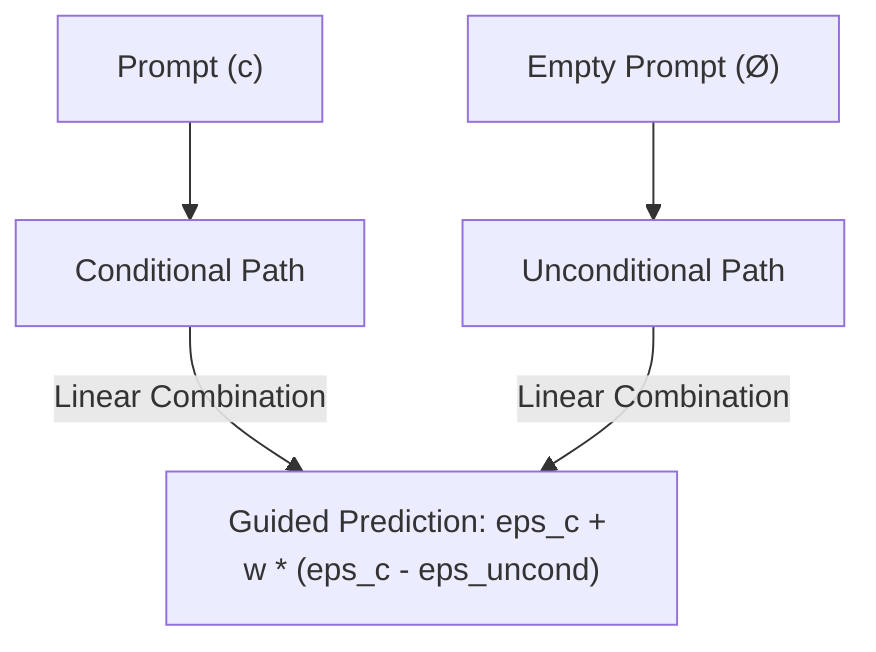

# Classifier-Free Guidance (CFG)

## Overview
Classifier-Free Guidance is a technique to improve the alignment of generative models with conditional prompts (e.g., text) without using a separate classifier network. During training, the conditioning text is randomly discarded, allowing the model to perform both conditional and unconditional denoising.

## Diagram

[Back to README](../README.md)
