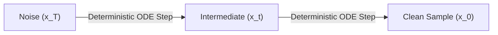

# Denoising Diffusion Implicit Models (DDIM)

## Overview
Denoising Diffusion Implicit Models (DDIM) generalize DDPM to non-Markovian forward processes. Because the forward process is deterministic given $x_0$, the generation process can skip steps, allowing much faster sampling without retraining the model.

## Diagram

## Features
- Shorter sampling times (20-50 steps instead of 1000).
- Deterministic encoding/reconstruction.

[Back to README](../README.md)
