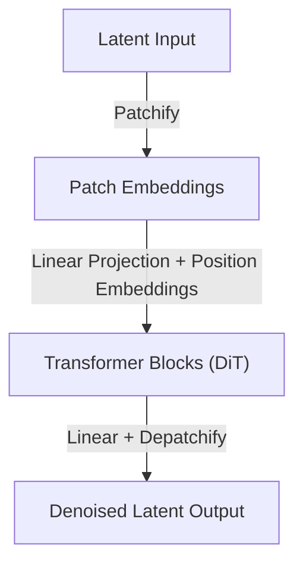

# Diffusion Transformers (DiT)

## Overview
Diffusion Transformers (DiT) replace the traditional convolutional U-Net backbone in diffusion models with a Vision Transformer (ViT) architecture. Images or latents are sliced into a sequence of patch embeddings, which are then processed by transformer blocks.

## Diagram

## Key Features
- High scalability: follows predictable scaling laws similar to LLMs.
- Efficient representation of multi-modal data.

[Back to README](../README.md)
