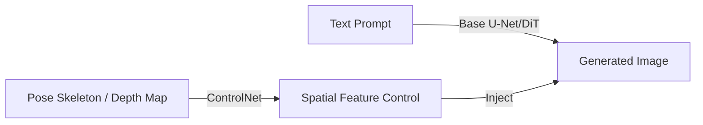

# Fine-Grained Layout Control Deficit

## Overview
While text prompts capture general concepts, they lack precision for pixel-level layout, human posture, or edge alignment. ControlNet and IP-Adapter solve this by introducing secondary conditioning networks.

## Diagram

[Back to README](../README.md)
