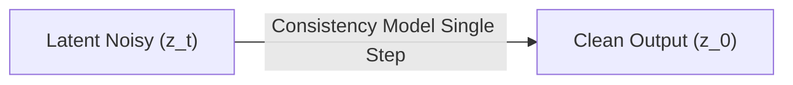

# Latent Consistency Models (LCM)

## Overview
Latent Consistency Models enable extremely fast image generation (1-4 steps) by learning a consistency function that directly maps any point along the flow trajectory to the origin (the clean image).

## Diagram

[Back to README](../README.md)
