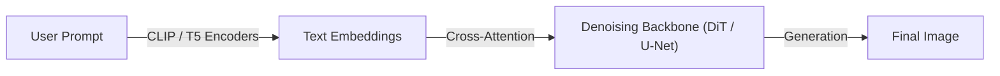

# Text-to-Image Foundation Engines

## Overview
Commercial and open-weight models (like Midjourney, FLUX, Stable Diffusion) process language prompts using language encoders (CLIP, T5) to guide spatial diffusion generation.

## Diagram

[Back to README](../README.md)
