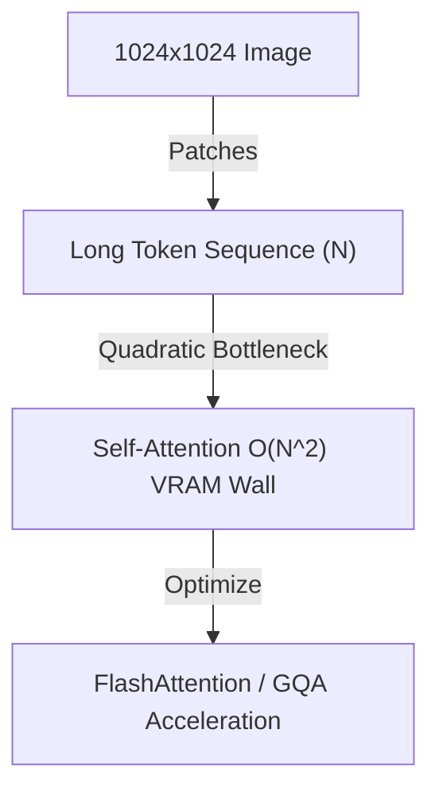

# Transformer Sequence Length Wall

## Overview
Generating high-resolution images or videos requires dividing latent maps into a large number of patch tokens. This scales the self-attention computation quadratically ($O(N^2)$), causing memory bottlenecks on GPUs.

## Solutions
- **FlashAttention:** IO-aware register caching.
- **Grouped-Query Attention (GQA):** Query pooling to optimize memory access.

## Diagram

[Back to README](../README.md)
