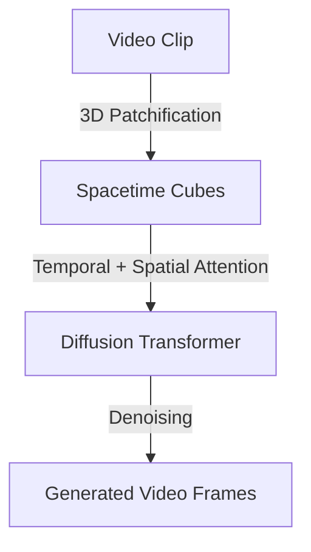

# Spatio-Temporal Video Generation

## Overview
Video models extend spatial generation to temporal sequences by tokenizing video clips into 3D spacetime cubes (patches across width, height, and time).

## Diagram

[Back to README](../README.md)
